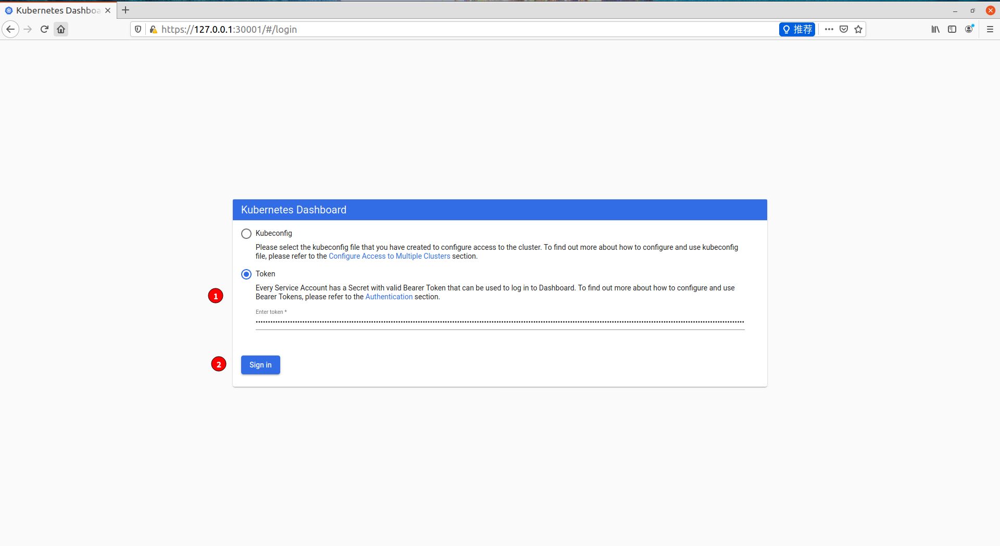
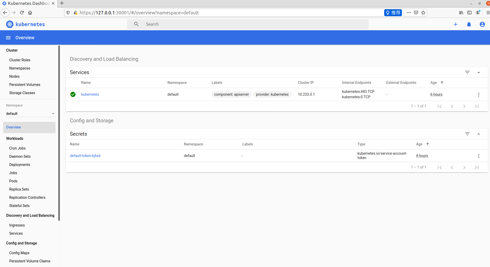

# kubernetes 1.18 二进制安装(单master)

## 一. OS和软件信息

- 操作系统: centos7.8 64 bit 最小化安装
- Docker: 19-ce
- kubernetes: 1.18
- etcd: 3.4

## 二. 服务器规划

|  角色   | IP  | 组件 |
|  ----  | ----  | ---- |
| k8s-master1  | 10.0.2.26 | kube-apiserver,kube-controller-manager, kube-scheduler, etcd |
| k8s-node1  | 10.0.2.27 | kubelet, kube-proxy, docker, etcd |
| k8s-node2  | 10.0.2.28 | kubelet, kube-proxy, docker, etcd |

## 三. 操作系统初始化配置

!> hosts文件请根据自己实际情况修改

```bash
# 安装基础软件
yum install epel-release -y
yum install wget jq vim -y

# 关闭防火墙
systemctl stop firewalld
systemctl disable firewalld

# 关闭selinux
sed -i 's/enforcing/disabled' /etc/selinux/config  # 永久
setenforce 0 # 临时

# 关闭swap
sed -ri 's/.*swap.*/#&/' /etc/fstab  # 永久
swapoff -a # 临时

# 在master上添加hosts
cat >> /etc/hosts << EOF
10.0.2.26 k8s-master
10.0.2.27 k8s-node1
10.0.2.28 k8s-node2
EOF

# 将桥接的IPv4流量传递到iptables的链
cat > /etc/sysctl.d/k8s.conf << EOF
net.bridge.bridge-nf-call-ip6tables = 1
net.bridge.bridge-nf-call-iptables = 1
EOF
sysctl --system # 生效

# 时间同步
yum install ntpdate -y
ntpdate time.windows.com
```

## 四. 部署etcd集群

Etcd是一个分布式键值存储系统，kubernetes使用Etcd进行数据存储，所以先准备一个Ectd数据库，为解决Etcd单点故障，应采用集群方式部署，这里使用3台组建集群，可容忍1台机器故障，当然你也可以使用5台组建集群，可容忍2台机器故障

!> 注： 为了节省机器，这里与k8s节点机器复用.也可以独立于k8s集群之外部署，只要apiserver能连接到就行。

| 节点名称 | IP |
| ---- | ---- |
| etcd-1 | 10.0.2.26 |
| etcd-2 | 10.0.2.27 |
| etcd-3 | 10.0.2.28 |

### 4-1. 准备cfssl证书生成工具
cfssl 是一个开源证书管理工具，使用json文件生成证书，相比openssl更方便使用.<br>
找任意一台服务器操作，这里使用Master节点。

```
wget https://pkg.cfssl.org/R1.2/cfssl_linux-amd64
wget https://pkg.cfssl.org/R1.2/cfssljson_linux-amd64
wget https://pkg.cfssl.org/R1.2/cfssl-certinfo_linux-amd64
chmod +x cfssl_linux-amd64 cfssljson_linux-amd64 cfssl-certinfo_linux-amd64
mv cfssl_linux-amd64 /usr/local/bin/cfssl
mv cfssljson_linux-amd64 /usr/local/bin/cfssljson
mv cfssl-certinfo_linux-amd64 /usr/local/bin/cfssl-certinfo
```

### 4-2. 生成Etcd证书

#### 4-2-1. 自签证书颁发机构（CA）

创建工作目录

```bash
mkdir -p ~/TLS/{etcd,k8s}
cd ~/TLS/etcd
```
自签CA:

```bash
cat > ca-config.json << EOF
{
    "signing":{
        "default":{
            "expiry":"87600h"
        },
        "profiles":{
            "www":{
                "expiry":"87600h",
                "usages":[
                    "signing",
                    "key encipherment",
                    "server auth",
                    "client auth"
                ]
            }
        }
    }
}
EOF

cat > ca-csr.json << EOF
{
    "CN": "etcd CA",
    "key": {
        "algo": "rsa",
        "size": 2048
    },
    "names": [
        {
            "C": "CN",
            "L": "Beijing",
            "ST": "Beijing"
        }
     ]
}
EOF
```

生成证书：
```bash
cfssl gencert -initca ca-csr.json | cfssljson -bare ca -

ls *pem
ca-key.pem ca.pem
```

#### 4-2-2. 使用自签证书CA颁发Etcd HTTPS证书

创建证书申请文件：

!> 注： hosts字段中IP为所有Etcd节点的集群内部通信IP，一个都不能少！ 为了后期扩容方便，可以多写几个预留IP
```bash
cat > server-csr.json << EOF
{
    "CN": "etcd",
    "hosts": [
        "10.0.2.26",
        "10.0.2.27",
        "10.0.2.28"
    ],
    "key": {
        "algo": "rsa",
        "size": 2048
    },
    "names": [
        {
            "C": "CN",
            "L": "Beijing",
            "ST": "Beijing"
        }
    ]
}
EOF
```

生成证书：

```bash
cfssl gencert -ca=ca.pem -ca-key=ca-key.pem -config=ca-config.json -profile=www server-csr.json | cfssljson -bare server

ls  server*pem
server-key.pem  server.pem
```

### 4-3. 从Github下载二进制文件

下载地址：

```
cd ~
wget https://github.com/etcd-io/etcd/releases/download/v3.4.13/etcd-v3.4.13-linux-amd64.tar.gz
```

### 4-4. 部署Etcd集群

以下在节点1上操作，为简化操作，将节点1生成的文件拷贝到节点2和节点3

#### 4-4-1. 创建工作目录并解压二进制包

```bash
mkdir /opt/etcd/{bin,cfg,ssl} -p
tar -zxvf etcd-v3.4.13-linux-amd64.tar.gz
mv etcd-v3.4.13-linux-amd64/{etcd,etcdctl} /opt/etcd/bin/
```

#### 4-4-2. 创建etcd配置文件
```bash
# etcd-1
cat > /opt/etcd/cfg/etcd.conf << EOF
#[Member]
ETCD_NAME="etcd-1"
ETCD_DATA_DIR="/var/lib/etcd/default.etcd"
ETCD_LISTEN_PEER_URLS="https://10.0.2.26:2380"
ETCD_LISTEN_CLIENT_URLS="https://10.0.2.26:2379"
#[Clustering]
ETCD_INITIAL_ADVERTISE_PEER_URLS="https://10.0.2.26:2380"
ETCD_ADVERTISE_CLIENT_URLS="https://10.0.2.26:2379"
ETCD_INITIAL_CLUSTER="etcd-1=https://10.0.2.26:2380,etcd-2=https://10.0.2.27:2380,etcd-3=https://10.0.2.28:2380"
ETCD_INITIAL_CLUSTER_TOKEN="etcd-cluster"
ETCD_INITIAL_CLUSTER_STATE="new"
EOF
```
```bash
# etcd-2
cat > /opt/etcd/cfg/etcd.conf << EOF
#[Member]
ETCD_NAME="etcd-2"
ETCD_DATA_DIR="/var/lib/etcd/default.etcd"
ETCD_LISTEN_PEER_URLS="https://10.0.2.27:2380"
ETCD_LISTEN_CLIENT_URLS="https://10.0.2.27:2379"
#[Clustering]
ETCD_INITIAL_ADVERTISE_PEER_URLS="https://10.0.2.27:2380"
ETCD_ADVERTISE_CLIENT_URLS="https://10.0.2.27:2379"
ETCD_INITIAL_CLUSTER="etcd-1=https://10.0.2.26:2380,etcd-2=https://10.0.2.27:2380,etcd-3=https://10.0.2.28:2380"
ETCD_INITIAL_CLUSTER_TOKEN="etcd-cluster"
ETCD_INITIAL_CLUSTER_STATE="new"
EOF

```

```bash
# etcd-3
cat > /opt/etcd/cfg/etcd.conf << EOF
#[Member]
ETCD_NAME="etcd-3"
ETCD_DATA_DIR="/var/lib/etcd/default.etcd"
ETCD_LISTEN_PEER_URLS="https://10.0.2.28:2380"
ETCD_LISTEN_CLIENT_URLS="https://10.0.2.27:2379"
#[Clustering]
ETCD_INITIAL_ADVERTISE_PEER_URLS="https://10.0.2.28:2380"
ETCD_ADVERTISE_CLIENT_URLS="https://10.0.2.28:2379"
ETCD_INITIAL_CLUSTER="etcd-1=https://10.0.2.26:2380,etcd-2=https://10.0.2.27:2380,etcd-3=https://10.0.2.28:2380"
ETCD_INITIAL_CLUSTER_TOKEN="etcd-cluster"
ETCD_INITIAL_CLUSTER_STATE="new"
EOF

```

#### 4-4-3. systemd管理etcd

!> 各节点都执行

```bash
cat > /usr/lib/systemd/system/etcd.service << EOF
[Unit]
Description=Etcd Server
After=network.target
After=network-online.target
Wants=network-online.target
[Service]
Type=notify
EnvironmentFile=/opt/etcd/cfg/etcd.conf
ExecStart=/opt/etcd/bin/etcd \
--cert-file=/opt/etcd/ssl/server.pem \
--key-file=/opt/etcd/ssl/server-key.pem \
--peer-cert-file=/opt/etcd/ssl/server.pem \
--peer-key-file=/opt/etcd/ssl/server-key.pem \
--trusted-ca-file=/opt/etcd/ssl/ca.pem \
--peer-trusted-ca-file=/opt/etcd/ssl/ca.pem \
--logger=zap
Restart=on-failure
LimitNOFILE=65536
[Install]
WantedBy=multi-user.target
EOF
```

#### 4-4-4. 拷贝刚才生成的证书到各节点

```bash
cp ~/TLS/etcd/ca*pem ~/TLS/etcd/server*pem /opt/etcd/ssl/

scp ~/TLS/etcd/ca*pem ~/TLS/etcd/server*pem 10.0.2.27:/opt/etcd/ssl/

scp ~/TLS/etcd/ca*pem ~/TLS/etcd/server*pem 10.0.2.28:/opt/etcd/ssl/

```

#### 4-4-5. 启动etcd并设置开机启动

```bash
systemctl daemon-reload
systemctl start etcd
systemctl enable etcd
```

#### 4-4-6. 查看集群状态

```bash
ETCDCTL_API=3 /opt/etcd/bin/etcdctl --cacert=/opt/etcd/ssl/ca.pem --cert=/opt/etcd/ssl/server.pem \
--key=/opt/etcd/ssl/server-key.pem --endpoints="https://10.0.2.26:2379,https://10.0.2.27:2379,https://10.0.2.28:2379" \
endpoint health
```

## 五. 安装Docker

!> 每个节点都需要安装

### 5-1. 下载安装包
```bash
cd ~/
wget https://download.docker.com/linux/static/stable/x86_64/docker-19.03.13.tgz
```
在所有节点安装.这里采用的是二进制方式安装

### 5-1. 解压二进制包

```bash
tar -zxvf docker-19.03.13.tgz
mv docker/* /usr/bin/
```

### 5-2. systemd管理docker

```bash
cat > /usr/lib/systemd/system/docker.service << EOF
[Unit]
Description=Docker Application Container Engine
Documentation=http://docs.docker.com
After=network-online.target firewalld.service
Wants=network-online.target
[Service]
Type=notify
ExecStart=/usr/bin/dockerd
ExecReload=/bin/kill -s HUP $MAINPID
# Having non-zero Limit*s causes performance problems due to accounting overhead
# in the kernel. We recommend using cgroups to do container-local accounting.
# Uncomment TasksMax if your systemd version supports it.
LimitNOFILE=infinity
LimitNPROC=infinity
LimitCORE=infinity
LimitSTACK=104857600
LimitSIGPENDING=600000
# Only systemd 226 and above support this version.
#TasksMax=infinity
TimeoutStartSec=0
# set delegate yes so that systemd does not reset the cgroups of docker containers
Delegate=yes
# kill only the docker process, not all processes in the cgroup
KillMode=process
Restart=on-failure
StartLimitBurst=3
StartLimitInterval=60s
[Install]
WantedBy=multi-user.target
EOF
```

### 5-3. 创建Docker配置文件

```bash
mkdir /etc/docker
cat >/etc/docker/daemon.json << EOF
{
  "registry-mirrors": [
    "https://registry.docker-cn.com",
    "http://hub-mirror.c.163.com",
    "https://docker.mirrors.ustc.edu.cn"
  ]
}
EOF
```
- registry-mirrors配置国内仓库

### 5-4. 启动并设置开机启动

```bash
systemctl daemon-reload
systemctl start docker
systemctl enable docker
```

## 六. 部署K8s Master Node

### 6-1. 生成kube-apiserver证书

#### 6-1-1. 自签证书颁发机构（CA）

!> k8s master上操作。本示例 10.0.2.26

```bash
cd ~/TLS/k8s/
cat > ca-config.json << EOF
{
    "signing":{
        "default":{
            "expiry":"87600h"
        },
        "profiles":{
            "kubernetes":{
                "expiry":"87600h",
                "usages":[
                    "signing",
                    "key encipherment",
                    "server auth",
                    "client auth"
                ]
            }
        }
    }
}
EOF
cat > ca-csr.json << EOF
{
    "CN": "kubernetes",
    "key": {
        "algo": "rsa",
        "size": 2048
    },
    "names": [
        {
            "C": "CN",
            "L": "Beijing",
            "ST": "Beijing",
            "O": "k8s",
            "OU": "System"
        }
     ]
}
EOF
```

生成证书：

```bash
cfssl gencert -initca ca-csr.json | cfssljson -bare ca -

ls *pem
ca-key.pem ca.pem
```

#### 6-1-2. 使用自签CA签发kube-apiserver HTTPS证书

!> hosts 字段中IP为所有master/LB/VIP IP,一个都不能少！ 为了方便以后扩容，可以多写几个预留的IP。

创建证书申请文件：
```bash
cat > server-csr.json << EOF
{
    "CN": "kubernetes",
    "hosts": [
        "127.0.0.1",
        "10.233.0.1",
        "10.0.2.26",
        "10.0.2.27",
        "10.0.2.28",
        "kubernetes",
        "kubernetes.default",
        "kubernetes.default.svc",
        "kubernetes.default.svc.cluster",
        "kubernetes.default.svc.cluster.local"
    ],
    "key": {
        "algo": "rsa",
        "size": 2048
    },
    "names": [
        {
            "C": "CN",
            "L": "Beijing",
            "ST": "Beijing",
            "O": "k8s",
            "OU": "System"
        }
    ]
}
EOF
```

生成证书：
```bash
cfssl gencert -ca=ca.pem -ca-key=ca-key.pem -config=ca-config.json -profile=kubernetes server-csr.json | cfssljson -bare server

ls  server*pem
server-key.pem  server.pem

```

### 6-2 从Github下载二进制文件

!> 打开连接会发现有很多包，下载一个server包就够了，包含了Master和Worker Node二进制文件

```bash
#https://github.com/kubernetes/kubernetes/blob/master/CHANGELOG/CHANGELOG-1.18.md#server-binaries
cd ~/
wget https://dl.k8s.io/v1.18.12/kubernetes-server-linux-amd64.tar.gz
```

### 6-3 解压二进制包

```bash
mkdir -p /opt/kubernetes/{bin,cfg,ssl,logs}
tar -zxvf kubernetes-server-linux-amd64.tar.gz
cd kubernetes/server/bin
cp kube-apiserver kube-scheduler kube-controller-manager /opt/kubernetes/bin
cp kubectl /usr/bin/
```

### 6-4 部署kube-apiserver

#### 6-4-1 创建配置文件

!> 两个反斜杠 \\ 第一个是转义符，第二个是换行符，使用转义符是为了使用EOF保留换行符

```bash
cat > /opt/kubernetes/cfg/kube-apiserver.conf << EOF
KUBE_APISERVER_OPTS="--logtostderr=false \\
--v=2 \\
--log-dir=/opt/kubernetes/logs \\
--etcd-servers=https://10.0.2.26:2379,https://10.0.2.27:2379,https://10.0.2.28:2379 \\
--bind-address=10.0.2.26 \\
--secure-port=6443 \\
--advertise-address=10.0.2.26 \\
--allow-privileged=true \\
--service-cluster-ip-range=10.233.0.0/24 \\
--enable-admission-plugins=NamespaceLifecycle,LimitRanger,ServiceAccount,ResourceQuota,NodeRestriction \\
--authorization-mode=RBAC,Node \\
--enable-bootstrap-token-auth=true \\
--token-auth-file=/opt/kubernetes/cfg/token.csv \\
--service-node-port-range=30000-32767 \\
--kubelet-client-certificate=/opt/kubernetes/ssl/server.pem \\
--kubelet-client-key=/opt/kubernetes/ssl/server-key.pem \\
--tls-cert-file=/opt/kubernetes/ssl/server.pem \\
--tls-private-key-file=/opt/kubernetes/ssl/server-key.pem \\
--client-ca-file=/opt/kubernetes/ssl/ca.pem \\
--service-account-key-file=/opt/kubernetes/ssl/ca-key.pem \\
--etcd-cafile=/opt/etcd/ssl/ca.pem \\
--etcd-certfile=/opt/etcd/ssl/server.pem \\
--etcd-keyfile=/opt/etcd/ssl/server-key.pem \\
--audit-log-maxage=30 \\
--audit-log-maxbackup=3 \\
--audit-log-maxsize=100 \\
--audit-log-path=/opt/kubernetes/logs/k8s-audit.log"
EOF
```

#### 6-4-2. 拷贝刚开生成的证书
把刚才生成的证书拷贝到配置文件中的路径：

```bash
cp ~/TLS/k8s/ca*pem ~/TLS/k8s/server*pem /opt/kubernetes/ssl/
```

#### 6-4-3. 启用TLS Bootstrapping机制

TLS Bootstrapping: Master apiserver启用TLS认证后，Node节点kubelet和kube-proxy要与kube-apiserver进行通信，必须使用CA签发的有效证书才可以，当Node节点很多时，这种客户端证书颁发需要大量工作，同样也会增加集群扩展复杂度。为了简化流程，Kubernetes引入了TLS bootstraping 机制来自动颁发客户端证书。kubelet会以一个低权限用户自动向apiserver申请证书，kubelet的证书有apiserver动态签署。所以强烈建议在Node上使用这种方式，目前主要用于kubelet，kube-proxy还是游我们统一颁发一个证书。

创建上述配置文件中token文件：
```bash
cat > /opt/kubernetes/cfg/token.csv << EOF
63231f68ae9fb0b621c8a81f9da74a61,kubelet-bootstrap,10001,"system:node-bootstrapper"
EOF
```
格式： token. 用户名，UID，用户组

token也可以自行替换：

```
head -c 16 /dev/urandom | od -An -t x |tr -d ''
```
#### 6-4-4. system管理apiserver

```bash
cat > /usr/lib/systemd/system/kube-apiserver.service << EOF
[Unit]
Description=LUbernetes API Server
Documentation=https://github.com/kubernetes/kubernetes
[Service]
EnvironmentFile=/opt/kubernetes/cfg/kube-apiserver.conf
ExecStart=/opt/kubernetes/bin/kube-apiserver \$KUBE_APISERVER_OPTS
Restart=on-failure
[Install]
WantedBy=multi-user.target
EOF
```

#### 6-4-5. 启动并设置开机启动

```bash
systemctl daemon-reload
systemctl start kube-apiserver     #启动服务
systemctl enable kube-apiserver    #开机启动
systemctl status kube-apiserver    #查看状态
```

#### 6-4-6. 授权kubelet-bootstrap用户允许请求证书

```bash
kubectl create clusterrolebinding kubelet-bootstrap \
--clusterrole=system:node-bootstrapper \
--user=kubelet-bootstrap
```

### 6-5. 部署kube-controller-manager

#### 6-5-1. 创建配置文件

```bash
cat > /opt/kubernetes/cfg/kube-controller-manager.conf << EOF
KUBE_CONTROLLER_MANAGER_OPTS="--logtostderr=false \\
--v=2 \\
--log-dir=/opt/kubernetes/logs \\
--leader-elect=true \\
--master=127.0.0.1:8080 \\
--bind-address=127.0.0.1 \\
--allocate-node-cidrs=true \\
--cluster-cidr=10.244.0.0/16 \\
--service-cluster-ip-range=10.233.0.0/24 \\
--cluster-signing-cert-file=/opt/kubernetes/ssl/ca.pem \\
--cluster-signing-key-file=/opt/kubernetes/ssl/ca-key.pem \\
--root-ca-file=/opt/kubernetes/ssl/ca.pem \\
--service-account-private-key-file=/opt/kubernetes/ssl/ca-key.pem \\
--experimental-cluster-signing-duration=87600h0m0s"
EOF
```

#### 6-5-2. systemd管理controller-manager
```bash
cat > /usr/lib/systemd/system/kube-controller-manager.service << EOF
[Unit]
Description=Kubernetes Controller Manager
Documentation=https://github.com/kubernetes/kubernetes
[Service]
EnvironmentFile=/opt/kubernetes/cfg/kube-controller-manager.conf
ExecStart=/opt/kubernetes/bin/kube-controller-manager \$KUBE_CONTROLLER_MANAGER_OPTS
Restart=on-failure
[Install]
WantedBy=multi-user.target
EOF
```

#### 6-5-3. 启动并设置开机启动

```bash
systemctl daemon-reload
systemctl start kube-controller-manager
systemctl enable kube-controller-manager
systemctl status kube-controller-manager
```

### 6-6. 部署kube-scheduler

#### 6-6-1. 创建配置文件

```bash
cat >/opt/kubernetes/cfg/kube-scheduler.conf << EOF
KUBE_SCHEDULER_OPTS="--logtostderr=false \
--v=2 \
--log-dir=/opt/kubernetes.logs \
--leader-elect \
--master=127.0.01:8080 \
--bind-address=127.0.0.1"
EOF
```

#### 6-6-2. systemd管理scheduler

```bash
cat > /usr/lib/systemd/system/kube-scheduler.service << EOF
[Unit]
Description=Kubernetes Scheduler
Documentation=https://github.com/kubernetes/kubernetes
[Service]
EnvironmentFile=/opt/kubernetes/cfg/kube-scheduler.conf
ExecStart=/opt/kubernetes/bin/kube-scheduler \$KUBE_SCHEDULER_OPTS
Restart=on-failure
[Install]
WantedBy=multi-user.target
EOF
```
#### 6-6-3. 启动并设置开机启动

```bash
systemctl daemon-reload
systemctl start kube-scheduler
systemctl enable kube-scheduler
systemctl status kube-scheduler
```

#### 6-6-4. 查看集群状态

所有组建都已经启动成功，通过kubectl工具查看当前集群组建状态：

```bash
kubectl get cs
NAME                 STATUS    MESSAGE             ERROR
controller-manager   Healthy   ok                  
scheduler            Healthy   ok                  
etcd-2               Healthy   {"health":"true"}   
etcd-0               Healthy   {"health":"true"}   
etcd-1               Healthy   {"health":"true"}
```
如上输出说明Master节点组件运行正常

## 七. 部署Worker Node

下面还是在Master Node上操作，即同时作为Worker Node

### 7-1. 创建工作目录并拷贝二进制文件

在所有worker node创建工作目录:

```bash
mkdir -p /opt/kubernetes/{bin,cfg,ssl,logs}
```
从master节点拷贝：
```bash
cd ~/kubernetes/server/bin
cp kubelet kube-proxy /opt/kubernetes/bin   #本地拷贝
scp kubelet kube-proxy 10.0.2.27:/opt/kubernetes/bin #远程拷贝
scp kubelet kube-proxy 10.0.2.28:/opt/kubernetes/bin #远程拷贝
```

### 7-2. 部署kubelet

#### 7-2-1. 创建配置文件

```bash
cat > /opt/kubernetes/cfg/kubelet.conf << EOF
KUBELET_OPTS="--logtostderr=false \\
--v=2 \\
--log-dir=/opt/kubernetes/logs \\
--hostname-override=k8s-master \\
--network-plugin=cni \\
--kubeconfig=/opt/kubernetes/cfg/kubelet.kubeconfig \\
--bootstrap-kubeconfig=/opt/kubernetes/cfg/bootstrap.kubeconfig \\
--config=/opt/kubernetes/cfg/kubelet-config.yml \\
--cert-dir=/opt/kubernetes/ssl \\
--pod-infra-container-image=lizhenliang/pause-amd64:3.0"
EOF
```

#### 7-2-2. 配置参数文件

```bash
cat > /opt/kubernetes/cfg/kubelet-config.yml << EOF
kind: KubeletConfiguration
apiVersion: kubelet.config.k8s.io/v1beta1
address: 0.0.0.0
port: 10250
readOnlyPort: 10255
cgroupDriver: cgroupfs
clusterDNS:
- 10.233.0.2
clusterDomain: cluster.local 
failSwapOn: false
authentication:
  anonymous:
    enabled: false
  webhook:
    cacheTTL: 2m0s
    enabled: true
  x509:
    clientCAFile: /opt/kubernetes/ssl/ca.pem 
authorization:
  mode: Webhook
  webhook:
    cacheAuthorizedTTL: 5m0s
    cacheUnauthorizedTTL: 30s
evictionHard:
  imagefs.available: 15%
  memory.available: 100Mi
  nodefs.available: 10%
  nodefs.inodesFree: 5%
maxOpenFiles: 1000000
maxPods: 110
EOF
```

#### 7-2-3. 生成bootstrap.kubeconfig文件

```bash
KUBE_APISERVER="https://10.0.2.26:6443" # apiserver IP:PORT
TOKEN="63231f68ae9fb0b621c8a81f9da74a61" # 与token.csv里保持一致

# 生成 kubelet bootstrap kubeconfig 配置文件
kubectl config set-cluster kubernetes \
  --certificate-authority=/opt/kubernetes/ssl/ca.pem \
  --embed-certs=true \
  --server=${KUBE_APISERVER} \
  --kubeconfig=bootstrap.kubeconfig
kubectl config set-credentials "kubelet-bootstrap" \
  --token=${TOKEN} \
  --kubeconfig=bootstrap.kubeconfig
kubectl config set-context default \
  --cluster=kubernetes \
  --user="kubelet-bootstrap" \
  --kubeconfig=bootstrap.kubeconfig
kubectl config use-context default --kubeconfig=bootstrap.kubeconfig
```

拷贝到配置文件路径：

```bash
cp bootstrap.kubeconfig /opt/kubernetes/cfg
```

#### 7-2-4. systemd管理kubelet

```bash
cat > /usr/lib/systemd/system/kubelet.service << EOF
[Unit]
Description=Kubernetes Kubelet
After=docker.service

[Service]
EnvironmentFile=/opt/kubernetes/cfg/kubelet.conf
ExecStart=/opt/kubernetes/bin/kubelet \$KUBELET_OPTS
Restart=on-failure
LimitNOFILE=65536

[Install]
WantedBy=multi-user.target
EOF
```

#### 7-2-5. 启动并设置开机启动

```bash
systemctl daemon-reload
systemctl start kubelet
systemctl enable kubelet
systemctl status kubelet
```

### 7-3. 批准kubelet证书申请并加入集群

#### 7-3-1. 查看证书请求

```bash
kubectl get csr
NAME                                                   AGE     SIGNERNAME                                    REQUESTOR           CONDITION
node-csr-OwTTat3nAnE4nQwIB3Kxr807BPDCn6QJ0aT28JbR2vM   2m15s   kubernetes.io/kube-apiserver-client-kubelet   kubelet-bootstrap   Pending
```

#### 7-3-2. 批准申请

```bash
kubectl  certificate approve node-csr-OwTTat3nAnE4nQwIB3Kxr807BPDCn6QJ0aT28JbR2vM 

#查看请求变成 Approved,Issued状态
kubectl get csr
NAME                                                   AGE     SIGNERNAME                                    REQUESTOR           CONDITION
node-csr-OwTTat3nAnE4nQwIB3Kxr807BPDCn6QJ0aT28JbR2vM   5m23s   kubernetes.io/kube-apiserver-client-kubelet   kubelet-bootstrap   Approved,Issued
```

#### 7-3-3. 查看节点

!> 由于网络插件还没有部署，节点会没有准备就绪 NotReady
```bash
kubectl get nodes

NAME         STATUS     ROLES    AGE    VERSION
k8s-master   NotReady   <none>   102s   v1.18.12
```

### 7-4 部署kube-proxy

#### 7-4-1. 创建配置文件

```bash
cat > /opt/kubernetes/cfg/kube-proxy.conf << EOF
KUBE_PROXY_OPTS="--logtostderr=false \\
--v=2 \\
--log-dir=/opt/kubernetes/logs \\
--config=/opt/kubernetes/cfg/kube-proxy-config.yml"
EOF
```
#### 7-4-2. 配置参数文件

```bash
cat > /opt/kubernetes/cfg/kube-proxy-config.yml << EOF
kind: KubeProxyConfiguration
apiVersion: kubeproxy.config.k8s.io/v1alpha1
bindAddress: 0.0.0.0
metricsBindAddress: 0.0.0.0:10249
clientConnection:
  kubeconfig: /opt/kubernetes/cfg/kube-proxy.kubeconfig
hostnameOverride: k8s-master
clusterCIDR: 10.233.0.0/24
EOF
```

#### 7-4-3. 生成kube-proxy.kubeconfig文件

生成kube-proxy证书

```bash
# 切换工作目录
cd ~/TLS/k8s

# 创建证书请求文件
cat > kube-proxy-csr.json << EOF
{
  "CN": "system:kube-proxy",
  "hosts": [],
  "key": {
    "algo": "rsa",
    "size": 2048
  },
  "names": [
    {
      "C": "CN",
      "L": "BeiJing",
      "ST": "BeiJing",
      "O": "k8s",
      "OU": "System"
    }
  ]
}
EOF

# 生成证书
cfssl gencert -ca=ca.pem -ca-key=ca-key.pem -config=ca-config.json -profile=kubernetes kube-proxy-csr.json | cfssljson -bare kube-proxy

ls kube-proxy*pem
kube-proxy-key.pem  kube-proxy.pem
```

生成kubeconfig文件：

```bash
KUBE_APISERVER="https://10.0.2.26:6443"

kubectl config set-cluster kubernetes \
  --certificate-authority=/opt/kubernetes/ssl/ca.pem \
  --embed-certs=true \
  --server=${KUBE_APISERVER} \
  --kubeconfig=kube-proxy.kubeconfig
kubectl config set-credentials kube-proxy \
  --client-certificate=./kube-proxy.pem \
  --client-key=./kube-proxy-key.pem \
  --embed-certs=true \
  --kubeconfig=kube-proxy.kubeconfig
kubectl config set-context default \
  --cluster=kubernetes \
  --user=kube-proxy \
  --kubeconfig=kube-proxy.kubeconfig
kubectl config use-context default --kubeconfig=kube-proxy.kubeconfig
```
拷贝到配置文件指定路径：

```bash
cp kube-proxy.kubeconfig /opt/kubernetes/cfg/
scp kube-proxy.kubeconfig 10.0.2.27:/opt/kubernetes/cfg/
scp kube-proxy.kubeconfig 10.0.2.28:/opt/kubernetes/cfg/
```

#### 7-4-4. systemd管理kube-proxy

```bash
cat > /usr/lib/systemd/system/kube-proxy.service << EOF
[Unit]
Description=Kubernetes Proxy
After=network.target

[Service]
EnvironmentFile=/opt/kubernetes/cfg/kube-proxy.conf
ExecStart=/opt/kubernetes/bin/kube-proxy \$KUBE_PROXY_OPTS
Restart=on-failure
LimitNOFILE=65536

[Install]
WantedBy=multi-user.target
EOF
```

#### 7-4-5. 启动并设置开机启动

```bash
systemctl daemon-reload
systemctl start kube-proxy
systemctl enable kube-proxy
systemctl status kube-proxy
```

### 7-5. 部署CNI网络

```bash
cd ~/
wget https://github.com/containernetworking/plugins/releases/download/v0.8.6/cni-plugins-linux-amd64-v0.8.6.tgz
```

解压二进制包并移动到默认工作目录：
```bash
mkdir -p /opt/cni/bin
tar zxvf cni-plugins-linux-amd64-v0.8.6.tgz -C /opt/cni/bin
```

部署CNI网络：

!>默认镜像地址无法访问，修改为docker hub镜像仓库。
```bash
cd ~/
wget https://raw.githubusercontent.com/coreos/flannel/v0.12.0/Documentation/kube-flannel.yml
sed -i -r "s#quay.io/coreos/flannel:.*-amd64#lizhenliang/flannel:v0.12.0-amd64#g" kube-flannel.yml

kubectl apply -f kube-flannel.yml

kubectl get pods -n kube-system
NAME                          READY   STATUS    RESTARTS   AGE
kube-flannel-ds-amd64-2pc95   1/1     Running   0          72s

kubectl get nodes
NAME         STATUS   ROLES    AGE    VERSION
k8s-master   Ready    <none>   175m   v1.18.12

```

部署好网络插件，Node准备就绪。

### 7.6 授权apiserver访问kubelet

```bash
cat > apiserver-to-kubelet-rbac.yaml << EOF
apiVersion: rbac.authorization.k8s.io/v1
kind: ClusterRole
metadata:
  annotations:
    rbac.authorization.kubernetes.io/autoupdate: "true"
  labels:
    kubernetes.io/bootstrapping: rbac-defaults
  name: system:kube-apiserver-to-kubelet
rules:
  - apiGroups:
      - ""
    resources:
      - nodes/proxy
      - nodes/stats
      - nodes/log
      - nodes/spec
      - nodes/metrics
      - pods/log
    verbs:
      - "*"
---
apiVersion: rbac.authorization.k8s.io/v1
kind: ClusterRoleBinding
metadata:
  name: system:kube-apiserver
  namespace: ""
roleRef:
  apiGroup: rbac.authorization.k8s.io
  kind: ClusterRole
  name: system:kube-apiserver-to-kubelet
subjects:
  - apiGroup: rbac.authorization.k8s.io
    kind: User
    name: kubernetes
EOF

kubectl apply -f apiserver-to-kubelet-rbac.yaml
```

### 7-7. 新增加Worker Node

#### 7-7-1. 拷贝已部署好的Node相关文件到新节点

在master节点将Worker Node涉及文件拷贝到新节点10.0.2.27,10.0.2.28

```bash
# node 1
scp -r /opt/kubernetes root@10.0.2.27:/opt/

scp -r /usr/lib/systemd/system/{kubelet,kube-proxy}.service root@10.0.2.27:/usr/lib/systemd/system

scp -r /opt/cni/ root@10.0.2.27:/opt/

scp /opt/kubernetes/ssl/ca.pem root@10.0.2.27:/opt/kubernetes/ssl

# node 2
scp -r /opt/kubernetes root@10.0.2.28:/opt/

scp -r /usr/lib/systemd/system/{kubelet,kube-proxy}.service root@10.0.2.28:/usr/lib/systemd/system

scp -r /opt/cni/ root@10.0.2.28:/opt/

scp /opt/kubernetes/ssl/ca.pem root@10.0.2.28:/opt/kubernetes/ssl
```

#### 7-7-2. 删除kubelet证书和kubeconfig文件（新node上）

!> 这几个文件是证书申请审批后自动生成的，每个Node不同，必须删除重新生成。
```bash
rm -f /opt/kubernetes/cfg/kubelet.kubeconfig 
rm -f /opt/kubernetes/ssl/kubelet*
```

#### 7-7-3. 修改主机名(新node上)

```bash
#node 1
vi /opt/kubernetes/cfg/kubelet.conf
--hostname-override=k8s-node1

vi /opt/kubernetes/cfg/kube-proxy-config.yml
hostnameOverride: k8s-node1

#node 2
vi /opt/kubernetes/cfg/kubelet.conf
--hostname-override=k8s-node2

vi /opt/kubernetes/cfg/kube-proxy-config.yml
hostnameOverride: k8s-node2
```

#### 7-7-4. 启动并设置开机启动 （新node上）

```bash
systemctl daemon-reload
systemctl start kubelet
systemctl enable kubelet
systemctl start kube-proxy
systemctl enable kube-proxy
```

#### 7-7-5. 在Master上批准新Node kubelet证书申请

```bash
# 查看申请
[root@k8s-master ~]# kubectl get csr
NAME                                                   AGE     SIGNERNAME                                    REQUESTOR           CONDITION
node-csr-OwTTat3nAnE4nQwIB3Kxr807BPDCn6QJ0aT28JbR2vM   3h17m   kubernetes.io/kube-apiserver-client-kubelet   kubelet-bootstrap   Approved,Issued
node-csr-wWkbtpZSe5C-yKpeP7P9Fz-n2S82DWatLgHLSEXTlgQ   43s     kubernetes.io/kube-apiserver-client-kubelet   kubelet-bootstrap   Pending
node-csr-yKD1ovCFY4q78dzVGWRthfysbLOmnoFUW0_2zP3Zm3o   39s     kubernetes.io/kube-apiserver-client-kubelet   kubelet-bootstrap   Pending

# 通过申请
[root@k8s-master ~]# kubectl certificate approve node-csr-wWkbtpZSe5C-yKpeP7P9Fz-n2S82DWatLgHLSEXTlgQ
certificatesigningrequest.certificates.k8s.io/node-csr-wWkbtpZSe5C-yKpeP7P9Fz-n2S82DWatLgHLSEXTlgQ approved
[root@k8s-master ~]# kubectl certificate approve node-csr-yKD1ovCFY4q78dzVGWRthfysbLOmnoFUW0_2zP3Zm3o 
certificatesigningrequest.certificates.k8s.io/node-csr-yKD1ovCFY4q78dzVGWRthfysbLOmnoFUW0_2zP3Zm3o approved
```

#### 7-7-7. 查看node状态

需要等一会儿，新的node就变成Ready了
```bash
[root@k8s-master ~]# kubectl get nodes
NAME         STATUS   ROLES    AGE     VERSION
k8s-master   Ready    <none>   3h16m   v1.18.12
k8s-node1    Ready    <none>   4m1s    v1.18.12
k8s-node2    Ready    <none>   3m49s   v1.18.12

```

## 八. 部署Dashboard和CoreDNS

### 8-1 部署Dashboard

```
cd ~/
wget https://raw.githubusercontent.com/kubernetes/dashboard/v2.0.0-beta8/aio/deploy/recommended.yaml
```
!> 默认Dashboard只能集群内部访问，修改Service为NodePort类型，暴露到外部：

```bash
vi recommended.yaml

...
kind: Service
apiVersion: v1
metadata:
  labels:
    k8s-app: kubernetes-dashboard
  name: kubernetes-dashboard
  namespace: kubernetes-dashboard
spec:
  ports:
    - port: 443
      targetPort: 8443
      nodePort: 30001
  type: NodePort
  selector:
    k8s-app: kubernetes-dashboard
...

kubectl apply -f recommended.yaml
```

```bash
[root@k8s-master ~]# kubectl get pods,svc -n kubernetes-dashboard
NAME                                             READY   STATUS    RESTARTS   AGE
pod/dashboard-metrics-scraper-694557449d-5z7hk   1/1     Running   0          6m14s
pod/kubernetes-dashboard-9774cc786-59274         1/1     Running   0          6m14s

NAME                                TYPE        CLUSTER-IP     EXTERNAL-IP   PORT(S)         AGE
service/dashboard-metrics-scraper   ClusterIP   10.233.0.18    <none>        8000/TCP        6m14s
service/kubernetes-dashboard        NodePort    10.233.0.176   <none>        443:30001/TCP   6m14s
```

访问地址: https://NodeIP:30001


创建service account并绑定默认cluster-admin管理员集群角色：

```bash
# 获取token
kubectl create serviceaccount dashboard-admin -n kube-system
kubectl create clusterrolebinding dashboard-admin --clusterrole=cluster-admin --serviceaccount=kube-system:dashboard-admin
kubectl describe secrets -n kube-system $(kubectl -n kube-system get secret | awk '/dashboard-admin/{print $1}')
```

使用输出的token登录Dashboard。





### 8-2. kube DNS 

暂不需要