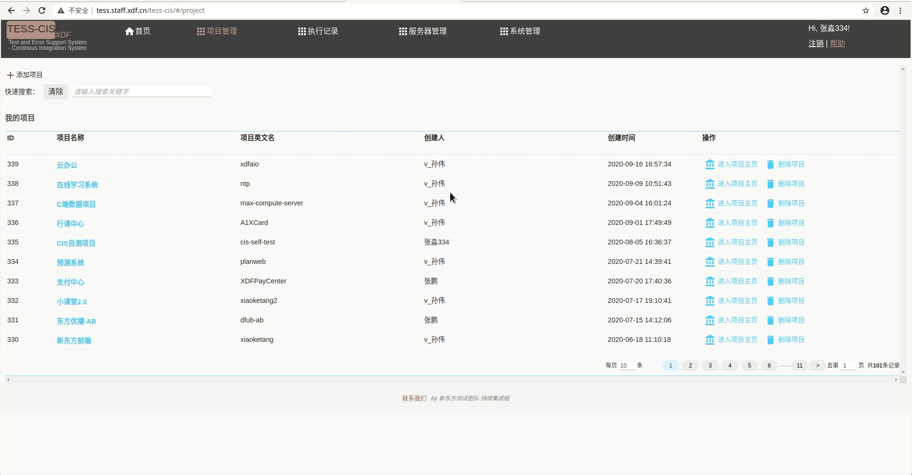
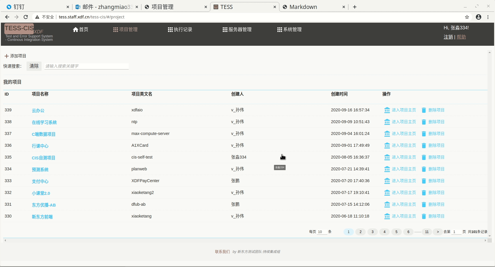

# 项目管理

- [项目管理首页](http://tess.staff.xdf.cn/tess-cis/#/project)： http://tess.staff.xdf.cn/tess-cis/#/project

## 添加项目
?>将`TFS`或`JIRA`上的项目添加到CIS

!>如需添加项目，请联系管理员

- :link:项目管理首页 > 项目管理 > 添加项目


## 项目设置

### 基本信息

?>对项目的信息进行修改，如`项目来源`、`项目名称`、`公开性`、`描述信息`等。

:link:项目管理首页 > 项目管理 > 操作 > 进入项目首页 > 项目设置 > 基本信息 > 编辑



### 项目人员权限

?>对项目的人员和权限进行修改，如`添加用户`调整`用户权限`等

:link:系统首页 > 项目管理 > 操作 > 进入项目首页 > 项目设置 > 项目人员权限 > 编辑




### 服务器资源

?>对项目的虚拟机资源进行`增加`、`删除`或`修改`操作。

:link:系统首页 > 项目管理 > 操作 > 进入项目首页 > 项目设置 > 服务器资源

!>仅`默认流水线`需要在此配置服务器资源，并将agent部署到添加的服务器。方法如下：

- 下载agent到新添加的服务器

```bash
wget http://10.15.5.107/jnlpJars/agent.jar
```
- 启动agent

```bash
# 如果服务器离线，请在服务器上执行以下命令，重新注册服务器
# 如果服务器需要进行更换，请将旧服务器的Agent终止，并在新服务器上请上执行以下命令，完成新服务器注册
nohup java -jar agent.jar -jnlpUrl http://10.15.5.107/computer/<添加成功服务器后自动生成>/slave-agent.jnlp -workDir "" &
```

- 操作举例


### 子项目管理


